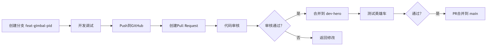

# 2026-RM-MechaCore

本仓库用作26赛季开发仓库

## 文件目录

暂定为如下方式

```
2026-RM-MechaCore/
├── core/                  	# 核心通用库（所有车共用）
│   ├── HAL/           		# 接口抽象层
│   ├── BSP/        		# 外设驱动层
│   └── APP/         		# 应用层
│   └── Alg/         		# 算法层
│   └── TASK/         		# 任务层肯定每台车不一样，看情况统一
│
├── robots/                # 兵种专属实现（核心目录）
│   ├── hero/              # 英雄
│   │   ├── config.hpp/    # 进行云台与底盘各项参数的配置
│   │   ├── chassis/       # 英雄底盘
│   │   ├── gimbal/        # 英雄云台
│   │   └── ...            
│   │
│   ├── infantry/          # 步兵
│   │   ├── config.hpp/    # 进行云台与底盘各项参数的配置
│   │   ├── chassis/       # 步兵底盘
│   │   ├── gimbal/        # 步兵云台
│   │   └── ...            
│   │
│   ├── engineer/          # 工程车
│   ├── sentry/            # 哨兵
│   └── ...            
├── common/                # 核心通用库开发
```

## 分支类型与提交规范

| **分支类型** | 命名规范             | 保护规则                                   |
| :----------- | :------------------- | :----------------------------------------- |
| `main`       | `main`               | 仅允许通过PR合并                           |
| 兵种开发     | `dev-<兵种>`         | 例: `dev-hero`, `dev-infantry`。通过PR合并 |
| 功能开发     | `feat/<兵种>-<功能>` | 例: `feat/hero-gimbal-pid`                 |
| 热修复       | `fix/<问题简述>`     | 从main、dev创建，合并回对应分支            |
| 文档编辑     | `docs/<问题简述>`    | 例: `docs/更新readme`                      |

## 紧急情况处理


1. 从main切出fix分支
2. 最小化修改并测试
3. 直接合并到main并打tag
4. 现场部署：git checkout main && git pull
5. 赛后同步到各dev-<兵种>分支

## PR与Reveiw

测试周期流程图



dev为各兵种的主力开发分支，定期合并至main(不用特别实时，但是一定要测试至稳定后)
