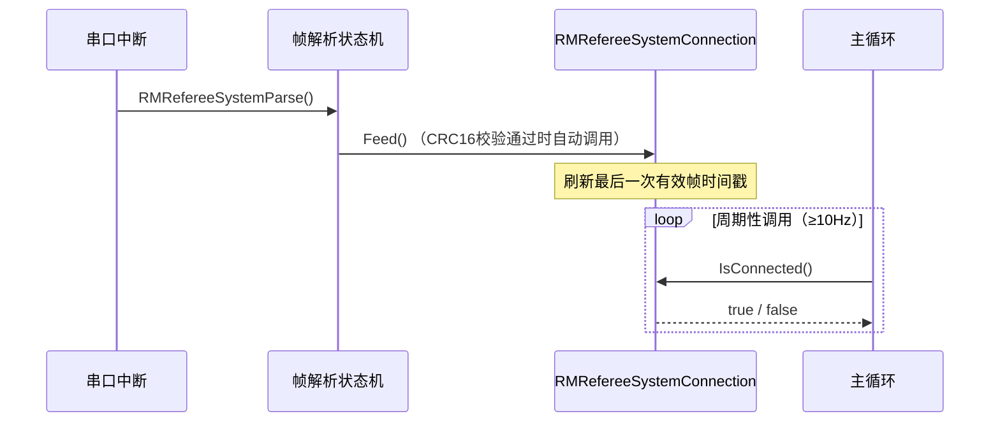

# RMRefereeSystem 裁判系统通信库

> RoboMaster 2026 裁判系统串口协议 V1.2.0（20260209）完整实现
>
> 📚 **适用对象**：需要接收和解析裁判系统数据的所有兵种机器人

---

## 📁 文件结构

```
RMRefereeSystem/
├── README.md                    # 本文档
├── RMRefereeSystem.hpp          # 协议结构体定义 + 全局变量声明 + 函数声明
├── RMRefereeSystem.cpp          # 串口接收状态机 + 帧解析 + 全局变量定义
├── RMRefereeSystemCRC.hpp       # CRC8 / CRC16 校验函数声明
└── RMRefereeSystemCRC.cpp       # CRC8 / CRC16 校验函数实现（官方查表法）
```

---

## 🎯 功能概述

本库实现了 **裁判系统串口协议 V1.2.0** 的完整接收与解析，包括：

1. **HAL UART 中断接收**：逐字节接收裁判系统串口数据
2. **帧解析状态机**：自动识别 SOF → CRC8 校验帧头 → 计算帧长 → CRC16 校验整帧
3. **数据分发**：根据 `cmd_id` 自动 `memcpy` 到对应的全局变量
4. **协议结构体**：覆盖常规链路（0x0001~0x020E）和图传链路（0x0301~0x0311）所有命令码

### 数据流


---

## 🚀 快速上手

### 第一步：配置 HAL 串口

在 `RMRefereeSystem.hpp` 顶部修改以下宏，指向你的裁判系统串口：

```cpp
#define HuartHandle_RMRefereeSystem   huart6     // 你的 UART 句柄
#define HuartDistance_RMRefereeSystem  USART6     // 对应的 USART 外设
```

### 第二步：启动接收

在初始化阶段开启第一次中断接收（通常在 `main.c` 或系统初始化函数中）：

```cpp
#include "RMRefereeSystem.hpp"

// 初始化时启动第一次中断接收
HAL_UART_Receive_IT(&HuartHandle_RMRefereeSystem, &MyRefereeSys8Data, 1);
```

### 第三步：注册串口回调

在 HAL UART 接收完成回调中调用解析入口：

```cpp
void HAL_UART_RxCpltCallback(UART_HandleTypeDef *huart)
{
    if (huart->Instance == HuartDistance_RMRefereeSystem)
    {
        RMRefereeSystemParse();  // 解析 + 自动重新开启中断接收
    }
}
```

### 第四步：在业务代码中读取数据

所有解析后的数据自动存放在全局变量中，直接读取即可：

```cpp
// 比赛状态
uint8_t progress = game_status_0x0001.game_progress;     // 当前比赛阶段
uint16_t remain  = game_status_0x0001.stage_remain_time;  // 剩余时间

// 机器人属性
uint16_t hp      = robot_status_0x0201.current_HP;        // 当前血量
uint16_t heat    = power_heat_data_0x0202.shooter_17mm_barrel_heat;  // 枪口热量
float    speed   = shoot_data_0x0207.initial_speed;       // 弹丸初速度

// 飞镖相关
uint8_t  dart_t  = dart_info_0x0105.dart_remaining_time;  // 飞镖发射口倒计时
uint8_t  target  = dart_info_0x0105.selected_target;      // 当前选定击打目标
uint8_t  status  = dart_client_cmd_0x020A.dart_launch_opening_status;  // 闸门状态

// 场地事件
uint32_t rune    = event_data_0x0101.ally_small_power_rune_status;  // 小能量机关状态

// 能量状态
uint8_t  low_pwr = buff_0x0204.energy_ge_30_pct;  // 剩余能量是否 ≥ 30%
```

---

## 📊 支持的命令码

### 常规链路（已实现解析和全局变量分发）

| 命令码 | 全局变量名 | 结构体类型 | 说明 | 频率 |
|:-------|:-----------|:-----------|:-----|:-----|
| `0x0001` | `game_status_0x0001` | `game_status_t` | 比赛状态数据 | 1Hz |
| `0x0002` | `game_result_0x0002` | `game_result_t` | 比赛结果数据 | — |
| `0x0003` | `game_robot_HP_0x0003` | `game_robot_HP_t` | 机器人血量数据 | 1Hz |
| `0x0101` | `event_data_0x0101` | `event_data_t` | 场地事件数据 | 1Hz |
| `0x0104` | `referee_warning_0x0104` | `referee_warning_t` | 裁判警告数据 | — |
| `0x0105` | `dart_info_0x0105` | `dart_info_t` | 飞镖发射相关数据 | 1Hz |
| `0x0201` | `robot_status_0x0201` | `robot_status_t` | 机器人性能体系数据 | 10Hz |
| `0x0202` | `power_heat_data_0x0202` | `power_heat_data_t` | 底盘缓冲能量和枪口热量 | 50Hz |
| `0x0203` | `robot_pos_0x0203` | `robot_pos_t` | 机器人位置数据 | 10Hz |
| `0x0204` | `buff_0x0204` | `buff_t` | 机器人增益和能量数据 | 1Hz |
| `0x0206` | `hurt_data_0x0206` | `hurt_data_t` | 伤害状态数据 | — |
| `0x0207` | `shoot_data_0x0207` | `shoot_data_t` | 实时射击数据 | — |
| `0x0208` | `projectile_allowance_0x0208` | `projectile_allowance_t` | 允许发弹量 | 10Hz |
| `0x0209` | `rfid_status_0x0209` | `rfid_status_t` | RFID 模块状态 | 3Hz |
| `0x020A` | `dart_client_cmd_0x020A` | `dart_client_cmd_t` | 飞镖选手端指令数据 | 10Hz |
| `0x020B` | `ground_robot_position_0x020B` | `ground_robot_position_t` | 地面机器人位置数据 | 1Hz |
| `0x020C` | `radar_mark_data_0x020C` | `radar_mark_data_t` | 雷达标记进度数据 | 1Hz |
| `0x020D` | `sentry_info_0x020D` | `sentry_info_t` | 哨兵自主决策信息同步 | 1Hz |
| `0x020E` | `radar_info_0x020E` | `radar_info_t` | 雷达自主决策信息同步 | 1Hz |

### 图传链路（仅提供结构体定义，未实现自动分发）

| 命令码 | 结构体类型 | 说明 |
|:-------|:-----------|:-----|
| `0x0301` | `robot_interaction_header_t` | 机器人交互数据（含图形绘制） |
| `0x0302` | `custom_robot_data_t` | 自定义控制器与机器人交互数据 |
| `0x0303` | `map_command_t` | 选手端小地图交互数据 |
| `0x0305` | `map_robot_data_t` | 选手端接收雷达数据 |
| `0x0307` | `map_path_data_t` | 选手端小地图接收路径数据 |
| `0x0308` | `custom_info_t` | 选手端小地图自定义消息 |
| `0x0309` | `robot_custom_data_t` | 机器人发送给自定义控制器 |
| `0x0310` | `robot_custom_data_2_t` | 机器人发送给自定义客户端 |
| `0x0311` | `robot_custom_data_3_t` | 自定义客户端发送给机器人 |

> 图传链路的数据长度不固定，需要根据业务逻辑在 `switch-case` 的 `default` 分支中自行添加解析。

---

## 🔧 全局变量命名规则

所有全局变量遵循统一的命名格式：

```
类型简称_0x命令码
```

| 规则 | 示例 | 说明 |
|:-----|:-----|:-----|
| 结构体名去掉 `_t` 后缀 | `game_status_t` → `game_status` | 简洁 |
| 追加 `_0x` + 4位命令码 | `game_status` + `0x0001` → `game_status_0x0001` | 唯一标识 |

---

## 🔬 位段语义化说明

本库对官方示例中以**整型变量表示多个 bit 含义**的字段进行了语义化拆分。每个被拆分的结构体都有详细的文档注释，标注了：

- **原字段名**：官方示例中的原始变量名和类型
- **修正后拆分为**：逐一列出新的位域成员和 bit 位置
- **typedef 末尾注释**：`// 原始名称：xxx_t（原为 uint32_t xxx）`

涉及语义化拆分的结构体：

| 命令码 | 结构体 | 被拆分的原字段 |
|:-------|:-------|:---------------|
| `0x0101` | `event_data_t` | `uint32_t event_data` → 16 个位域 |
| `0x0105` | `dart_info_t` | `uint16_t dart_info` → 4 个位域 |
| `0x0201` | `robot_status_t` | 末尾 3 bit → 3 个电源输出位域 |
| `0x0204` | `buff_t` | `uint8_t remaining_energy` → 7 个能量阈值位域 |
| `0x0206` | `hurt_data_t` | `uint8_t` → 2 个位域 |
| `0x0209` | `rfid_status_t` | `uint32_t` + `uint8_t` → 38 个增益点位域 |
| `0x020C` | `radar_mark_data_t` | `uint16_t mark_progress` → 12 个标记位域 |
| `0x020D` | `sentry_info_t` | `uint32_t` + `uint16_t` → 哨兵决策位域 |
| `0x020E` | `radar_info_t` | `uint8_t radar_info` → 6 个位域 |

---

## ⚙️ 帧解析状态机原理

按照协议帧格式 `frame_header(5) + cmd_id(2) + data(n) + frame_tail(2)`：

```
┌────────────────── 帧头（5 字节） ──────────────────┐
│ SOF(1) │ data_length(2) │ seq(1) │ CRC8(1)        │
├─────────────────────────────────────────────────────┤
│ cmd_id(2)                                           │
├─────────────────────────────────────────────────────┤
│ data(n 字节)                                        │
├─────────────────────────────────────────────────────┤
│ frame_tail / CRC16(2)                               │
└─────────────────────────────────────────────────────┘
```

**状态机流程**：

1. **等待 SOF**：扫描每个字节，直到遇到 `0xA5`
2. **收集帧头**：收够 5 字节后，用 `Verify_CRC8_Check_Sum` 校验帧头
3. **计算帧长**：`frame_len = 5 + 2 + data_length + 2`
4. **收集整帧**：继续接收直到收够 `frame_len` 字节
5. **校验整帧**：用 `Verify_CRC16_Check_Sum` 校验整帧
6. **解析分发**：校验通过后，根据 `cmd_id` 分发到对应全局变量

---

## 🔌 移植到其他机器人

### 修改串口配置

修改 `RMRefereeSystem.hpp` 中的两个宏即可：

```cpp
// 例如：某步兵使用 USART3
#define HuartHandle_RMRefereeSystem   huart3
#define HuartDistance_RMRefereeSystem  USART3
```

### 裁剪不需要的命令码

如果你的兵种不需要所有数据，可以在 `RMRefereeSystem.cpp` 的 `switch-case` 中删除不需要的 `case` 分支，并在 `.hpp` 中删除对应的 `extern` 声明和全局变量定义，减少 RAM 占用。

### 添加图传链路解析

在 `RMRefereeSystemParseData` 的 `default` 分支中添加对 `0x0301~0x0311` 的处理逻辑：

```cpp
case RM_CMD_ROBOT_INTERACTION:  // 0x0301
    // 解析 robot_interaction_header_t
    // 根据 data_cmd_id 做二次分发
    break;
```

---

## 📝 注意事项

1. **Keil Include Path**：确保本目录已添加到 Keil 工程的 Include Paths 中
2. **rx_buf 缓冲区大小要求**：
    协议规定帧总长度为：`帧头(5) + 命令码(2) + 数据(n) + CRC16(2)`
    - **如果只使用常规链路**：最大数据包不足 105 字节，状态机中的 `rx_buf[128]` 即可完全覆盖。
    - **如果要解析图传链路**：图传交互发送给客户端的指令数据（`0x0310`）最大数据长度可达 **300 字节**。此时理论最大帧长为 `5 + 2 + 6 + 300 + 2 = 315` 字节。
    因此，若需完整支持图传链路，**请务必将** `RMRefereeSystem.cpp` 中的 `rx_buf` 大小以及 `RMRefereeSystem.hpp` 中帧结构体的 `data` 数组大小**至少修改为 330 字节**（建议分配 `384` 甚至 `512` 字节以防越界）。

---

## 🔗 断连检测

本库内置了 `RMRefereeSystemConnector` 薄壳类，用于检测裁判系统是否在线。基于 `StateWatch` 超时机制，当超过设定时间（默认 1000ms）未收到有效帧时判定为离线。

### 原理



### API

| 方法 | 说明 |
|:-----|:-----|
| `Feed()` | 刷新时间戳（解析成功时内部自动调用，无需手动调用） |
| `IsConnected()` | 返回 `true`（在线）或 `false`（离线），内部自动更新时间并判定超时 |
| `GetStatus()` | 返回底层 `BSP::WATCH_STATE::Status` 枚举值 |

### 使用示例

```cpp
#include "RMRefereeSystem.hpp"

// 全局实例已定义，直接使用即可：
// extern RMRefereeSystemConnector RMRefereeSystemConnection;

// 主循环中周期性检查（建议 ≥10Hz）
void MainLoop()
{
    if (!RMRefereeSystemConnection.IsConnected())
    {
        // 裁判系统断连处理
        // 例如：蜂鸣器报警、LED 指示、限制射击等
    }
}
```

> **注意**：`Feed()` 已在帧解析成功时自动调用，用户只需在主循环中调用 `IsConnected()` 即可。
